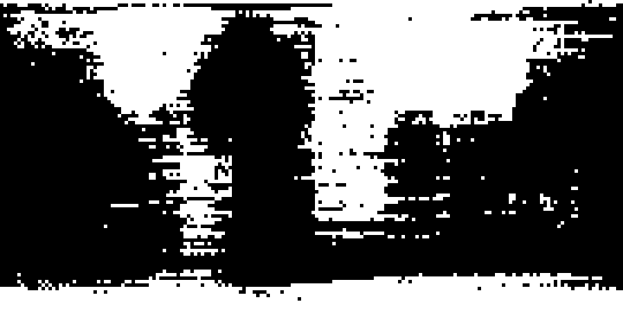
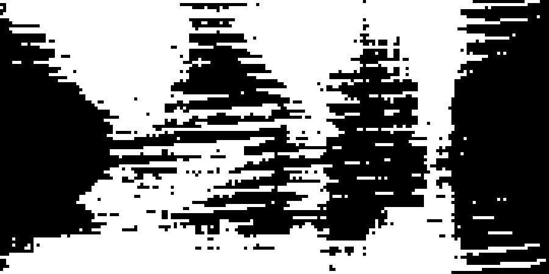
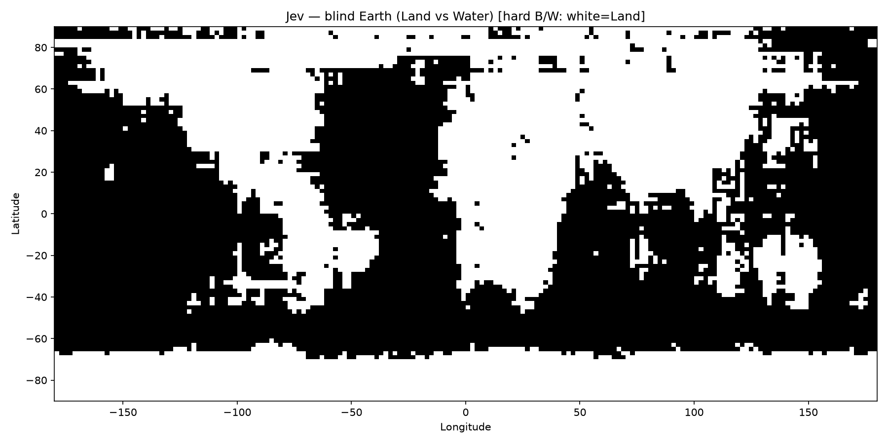

# Blind Earth — Clef / Clef-flash / Jev

Reproduction of Henry’s blind-Earth recipe ([How Does A Blind Model See The Earth?](https://outsidetext.substack.com/p/how-does-a-blind-model-see-the-earth)) adapted for **System One** decision models:

- **Clef** and **Clef-flash** via Cloudflare Workers AI
- **Jev** (`jev-latest`) via TypeSafe

Instead of open-ended generation, each lat/lon cell asks a binary **`choice`** question: **Land** vs **Water**. We threshold `P(Land) > 0.5` for hard black-and-white posters (**white = Land**, **black = Water**).

Blog write-up: [Blind Earth with Clef, Clef-flash, and Jev](https://dylanler.github.io/posts/blind-earth-clef-jev/)

## Grid

| | |
|---|---|
| Latitudes | `-89 … +89` step **2°** → 90 |
| Longitudes | `-179 … +179` step **2°** → 180 |
| Points | **16,200** |
| Batch size | **64** questions / request → 254 batches / model |
| Projection | Equirectangular, north-up |

## Sample request

```json
{
  "model": "clef",
  "state": "Answer geographic land/water questions about Earth coordinates. Land includes continents, islands, ice sheets, and snow-covered ground. Water includes oceans, seas, and other open water.",
  "questions": {
    "p_65_52": {
      "type": "choice",
      "instructions": "Is the location at 41°N, 73°W over land or over water?",
      "criteria": {
        "Land": "Over land, ice, or snow",
        "Water": "Over ocean, sea, or other water"
      }
    }
  }
}
```

Endpoints (no secrets in this repo — set env vars):

| Model | Endpoint | Auth |
|---|---|---|
| Clef | `POST https://api.cloudflare.com/client/v4/accounts/$CLOUDFLARE_ACCOUNT_ID/ai/run/@cf/cloudflare/clef` | `CLOUDFLARE_AUTH_TOKEN` |
| Clef-flash | `…/@cf/cloudflare/clef-flash` | same |
| Jev | `POST https://api.typesafe.ai/v1/systemone` (`model: "jev-latest"`) | `TYPESAFE_API_KEY` |

## Results (this run)

| Model | Wall (workers=8) | Hard land fraction | Mean P(Land) |
|---|---:|---:|---:|
| Clef | ~48.5 s | **0.383** | 0.416 |
| Clef-flash | ~27.7 s | **0.511** | 0.487 |
| Jev | ~5.0 s | **0.487** | 0.484 |

True Earth land fraction ≈ 0.29; all three over-predict land on this grid (especially high latitudes).

### Hard B&W maps

| Clef | Clef-flash | Jev |
|---|---|---|
|  |  |  |

Soft `P(Land)` greyscales live under [`maps/`](maps/). Compressed probability grids: [`grids/*_land_probs.npz`](grids/) (`land_probs` shape `(90, 180)` plus `lats` / `lons`).

Full per-point JSONL dumps are **not** shipped (regenerate with the script). A 20-line sample of each is in [`sample/`](sample/). See [`run_log.md`](run_log.md) for timing, tokens, and visual notes.

## Re-run

```bash
python3 -m venv .venv && source .venv/bin/activate
pip install -r requirements.txt

export CLOUDFLARE_ACCOUNT_ID=...     # required for Clef / Clef-flash
export CLOUDFLARE_AUTH_TOKEN=...
export TYPESAFE_API_KEY=...          # required for Jev

python3 run_blind_earth.py --model all --workers 8
# or one model:
python3 run_blind_earth.py --model jev --workers 8
# rebuild PNGs/npz from existing progress JSONL:
python3 run_blind_earth.py --model all --assemble-only
```

Progress appends to `progress/{model}_progress.jsonl` so interrupted runs resume cleanly.

## License

MIT — see [LICENSE](LICENSE).

Inspired by [Henry / outsidetext](https://outsidetext.substack.com/p/how-does-a-blind-model-see-the-earth). Not an official Cloudflare or TypeSafe demo.
